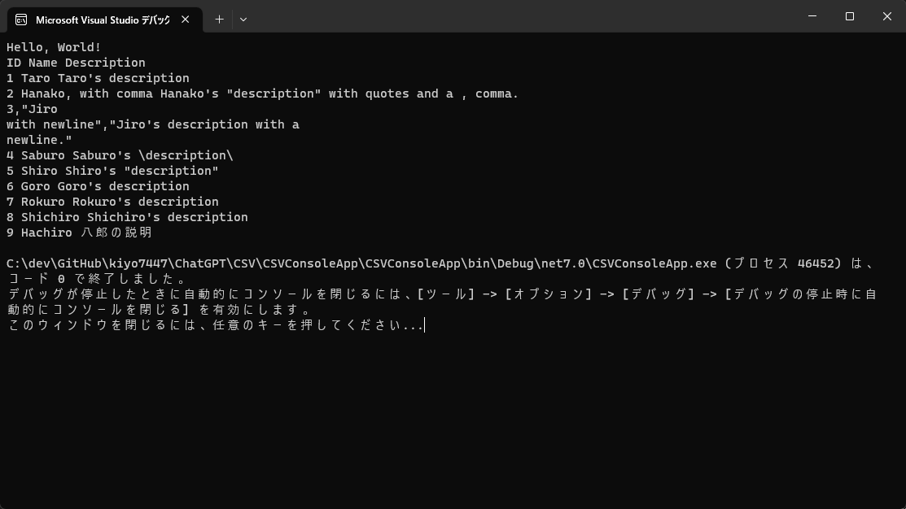

# CSVWriter
C#コードは、CSVファイルを作成し、データを書き込みます。  
カンマ、ダブルクォート、改行文字がデータ内に含まれている場合、CSVの標準的な仕様に従って適切にエスケープします。
# CSVReader
C#を使用してCSVファイルを取り込むための基本的なロジックです。  
このコードは、標準的なCSV仕様に従って、カンマやダブルクォートを処理します。System.IOとSystem.Text.RegularExpressions名前空間を使用しています。CSVファイルのパスを引数として受け取り、レコードのリストを返します。

# テスト結果
```C#
// テストデータ
var data = new List<List<string>>
            {
                new List<string> {"ID", "Name", "Description"},
                new List<string> {"1", "Taro", "Taro's description"},
                new List<string> {"2", "Hanako, with comma", "Hanako's \"description\" with quotes and a , comma."},
                new List<string> {"3", "Jiro\nwith newline", "Jiro's description with a \nnewline."},
                //テストパターンを追加
                new List<string> {"4", "Saburo", @"Saburo's \description\"},
                new List<string> {"5", "Shiro", "Shiro's \"description\""},
                new List<string> {"6", "Goro", "Goro's description"},
                new List<string> {"7", "Rokuro", "Rokuro's description"},
                new List<string> {"8", "Shichiro", "Shichiro's description"},
                new List<string> {"9", "Hachiro", "八郎の説明"},
            };
```

