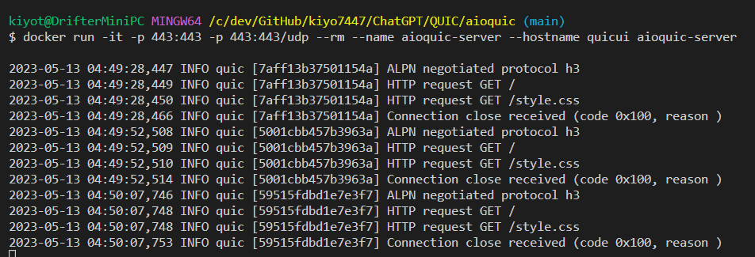
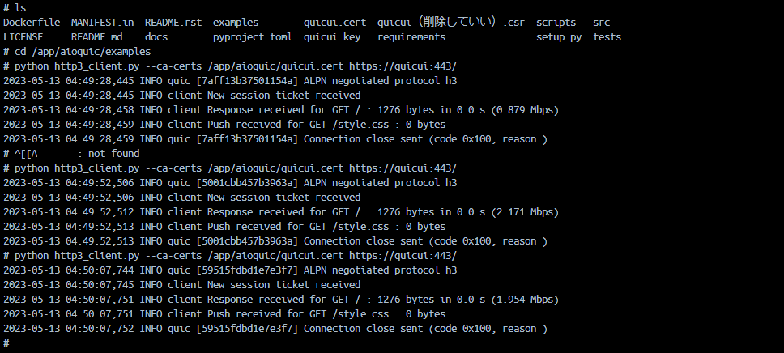



# サーバ
```bash
#Dockerをビルド
docker build -t aioquic-server .


#Dockerを起動
docker run -it -p 443:443 -p 443:443/udp --rm --name aioquic-server --hostname quicui aioquic-server

```


# クライアント
```bash
cd /app/aioquic/examples

python http3_client.py --ca-certs /app/aioquic/quicui.cert https://quicui:443/
```

普通に動作した。
